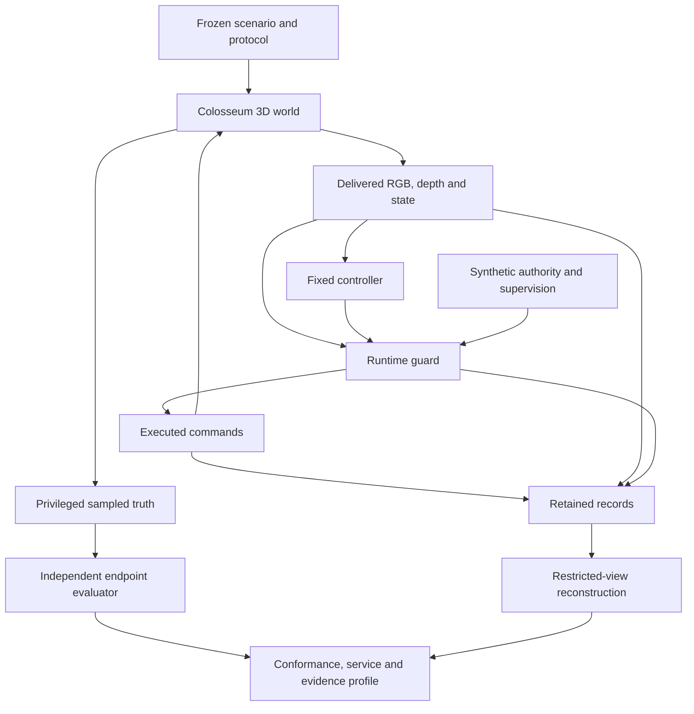

# Colosseum Alignment Research

**From embodied behaviour to evidence for ethical and safety arguments.**

Research software accompanying *Simulation-Based Alignment Research for Embodied Agents: A Colosseum Testbed for Autonomous UAVs in Civilian Defence*, by Zaid Marzguioui, Universität Regensburg. The manuscript develops a general simulation-based evaluation approach and examines it through a completed civilian UAV inspection study.

The central question is what a system's observed behaviour warrants us in claiming about it. This implementation separates the agent's observations, the guard's judgement, independently measured consequences, and what a later auditor can reconstruct. The separation makes disagreements inspectable: a monitor can endorse an unsafe episode, restraint can remove useful service, and a brief recovery can precede a later violation.

[Research design](docs/research-design.md) · [Reproducibility](docs/reproducibility.md) · [Citation](CITATION.cff) · [Contributing](CONTRIBUTING.md)

## Study at a glance

The completed design contains **792 selected episodes in 216 environments**, with a distinct **180-group primary comparison**. It uses a fixed, hand-written perception-based controller, three main guard configurations, and three additional configurations in the focused permission-constraint comparison. All 826 retained attempt records, including incomplete attempts, are accounted for in the manuscript's evidence package.

| Observation | Scope |
|---|---|
| The assumption-aware configuration has 7 physical violations, versus 76 for the policy-only configuration. | Descriptive totals over 216 episodes per main configuration. |
| Safe useful completions fall from 83 to 34. | Same 216-episode populations; restraint and service must be assessed together. |
| The policy-only guard accepts 161 episodes, including 48 with an independently established physical or procedural violation. | Acceptance and independent conformance are different measurements. |
| The assumption-aware guard accepts no episodes. | Its conditional false-assurance rate is undefined. |
| All seven assumption-aware physical-violation episodes first satisfy the short recovery endpoint. | Recovery within a specified horizon does not establish continued mission safety. |

These are findings within the selected simulated design. The primary physical contrast, uncertainty assumptions, follow-up selection and original sensitivity analysis are explained in the manuscript and [research design](docs/research-design.md). The results do not establish real-world incident rates, moral acceptability, learned-policy alignment or superiority across tasks.

## Architecture



Privileged truth is available to evaluation, not to the online controller or guard. Record ablations change the auditor's evidence while leaving the recorded flight unchanged. “Independent” describes this separation of execution and scoring; it does not imply an external laboratory or independent human review.

## Quick start: check the reported arithmetic

This check needs only Python's standard library and the `evidence.zip` supplied with the manuscript, including as a PDF attachment. The data archive is **not hosted in this repository**.

```bash
git clone https://github.com/theemperor66/colosseum-alignment-research.git
cd colosseum-alignment-research
git checkout v1.0.0
python3 scripts/verify_paper.py /path/to/evidence.zip
```

The verifier also accepts a freshly extracted evidence directory. It first verifies archive integrity, then checks design accounting, preservation of the 757 originally complete records, primary and focused contrasts, original sensitivity results, arm totals and derived-file hashes. It checks saved endpoint labels and their arithmetic; it does not reconstruct physical measurements from images or trajectories. A successful run reports `all_checks_passed: true`.

## Install and test the software

Use Python 3.12 for the development environment:

```bash
python3.12 -m venv .venv
source .venv/bin/activate
python -m pip install --require-hashes -r requirements-lock.txt
python -m pip install --no-deps -e .
make verify
```

These checks run on a CPU without a simulator. Fixtures and the separately labelled proposed reporting examples are synthetic software checks, not additional experiments. See [reproducibility](docs/reproducibility.md) for dependency pinning and the distinction between software checks, endpoint verification, raw-record reanalysis and new flights.

## Repository map

| Path | Purpose |
|---|---|
| `src/colosseum_assurance/` | Frozen runtime, perception, guards, evaluation, reconstruction and analysis modules. |
| `study/` | Fixed study specification, 15 protocol files, corrected scorer, study-specific analysis routines and file provenance. |
| `scripts/` | Public verification entry points. |
| `configs/` | Explicitly unqualified configuration examples for new environments. |
| `tests/` | CPU software checks with synthetic fixtures. |
| `proposed-code/` | Reporting-contract demonstrations developed after collection; excluded from claims about the executed flight policy. |
| `docs/` | Research design, reproducibility and interpretation guidance. |
| `CITATION.cff` | Software citation metadata for this release. |

The release preserves the study's scientific source while providing a public research interface around it. Its frozen plan retains precollection status text and the original scorer binding. The [documented scorer correction](docs/reproducibility.md#frozen-source-and-the-scorer-correction) governs the reported endpoint analysis; generic inherited settings do not redefine that analysis.

## Evidence, access and citation

The companion manuscript and compact evidence package are supplied separately. Appendix A.16 identifies this repository; Appendix A.7 describes the available evidence. Full raw-image and trajectory archives remain separately retained, without public access being asserted. The third-party simulator binary, Unreal assets, credentials and operational infrastructure are excluded from this release.

The public research release is version **1.0.0**. The frozen Python package retains its original internal version **0.1.0** to preserve the scientific snapshot; these identify different layers of the release.

Please cite release **v1.0.0** using [CITATION.cff](CITATION.cff) and record the commit used in any extension. This repository is the manuscript's software companion; no journal acceptance, public manuscript accession or DOI is claimed. Software licensing is specified in [LICENSE](LICENSE); it does not grant rights to excluded data or third-party simulator assets.
